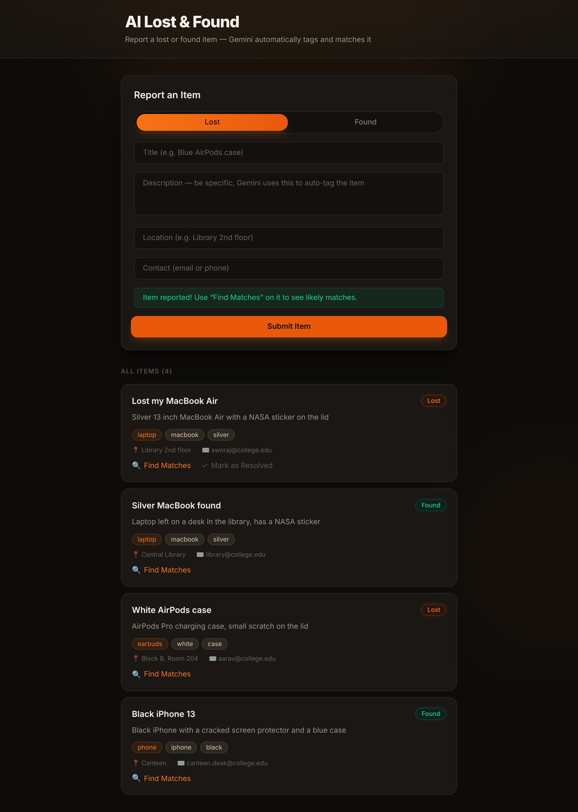
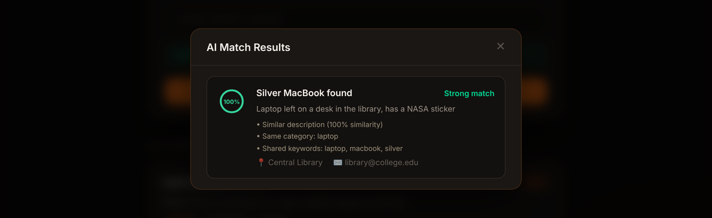
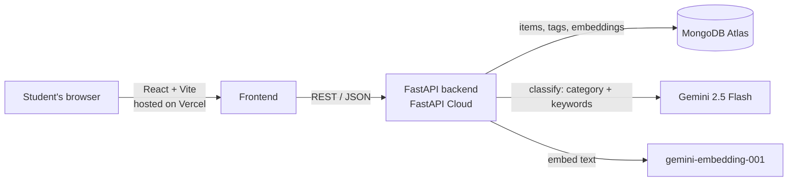

# AI Lost & Found

[](https://github.com/SworajKhadka/AI-Lost-And-Found/actions/workflows/ci.yml)
[](https://ai-lost-and-found-five.vercel.app)
[](LICENSE)

A lost-and-found board for schools and universities. Students report something they lost or found, Google Gemini tags each report automatically, and the app suggests which "found" reports most likely match a "lost" one (and the other way round).

**Live demo:** https://ai-lost-and-found-five.vercel.app  
**API docs (Swagger):** https://ai-lost-and-found.fastapicloud.dev/docs

<p align="center">
  
</p>
<p align="center">
  
</p>

## Why

Campus lost-and-found usually means a WhatsApp group or a notice board, where a "black earphones" post never meets the "found Sony headphones" post. This project tries to close that gap: every report gets structured with AI, and matching works on meaning rather than exact words.

## Features

- **Report lost or found items**: title, description, location and contact.
- **AI tagging**: Gemini 2.5 Flash returns a category (phone, laptop, earbuds, ID card, …) and 3–5 keywords. The output is constrained to a JSON schema, so it is always valid.
- **Semantic matching**: each report is embedded with `gemini-embedding-001`. Matches are ranked by meaning, so "AirPods" can match "white earbuds" with no shared words.
- **Explainable results**: each match shows why it was suggested (description similarity, same category, shared keywords).
- **Anonymous ownership**: the reporter's browser gets a one-time secret token and is the only one that can mark the item as resolved. No accounts are needed.
- **Resilient AI calls**: automatic retries with backoff. If Gemini is down, the item is still saved and flagged so a backfill script can tag it later.

## How matching works

When you click **Find Matches** on an item, the API compares it against every report with the opposite status (lost ↔ found):

| Signal | Points |
|---|---|
| Cosine similarity of the two embeddings, scaled from 0.82 → 0.95 | up to **70** |
| Same specific category (not `other`) | **+20** |
| Shared keywords, fuzzy (`iphone` ≈ `phone`) | **+5 each**, up to 10 |

Results below 35 are dropped and the rest are sorted best first. The similarity range is calibrated on real Gemini embeddings: unrelated campus items still score around 0.77–0.83, while true pairs score above 0.9. Items created before embeddings were added fall back to the original category + keyword scoring, so old data keeps working. The scoring lives in [`backend/core/matching.py`](backend/core/matching.py) and is unit-tested.

## Architecture



**Creating an item:** validate input → Gemini classifies it → Gemini embeds title + description + tags → save to MongoDB → return the item and its one-time owner token.

**Finding matches:** load the item → fetch candidates with the opposite status → score each pair → return the ranked matches with reasons.

## Tech stack

| Layer | Tech |
|---|---|
| Frontend | React 19, Vite, Tailwind CSS v4, Axios |
| Backend | Python, FastAPI, Pydantic v2 |
| AI | Google Gemini via the `google-genai` SDK (structured output + embeddings) |
| Database | MongoDB Atlas (PyMongo) |
| Testing / CI | pytest + mongomock, Ruff, ESLint, GitHub Actions |
| Hosting | Vercel (frontend), FastAPI Cloud (backend) |

## API

| Method | Endpoint | Description |
|---|---|---|
| `GET` | `/items/` | List all items |
| `GET` | `/items/{id}` | Get one item |
| `POST` | `/items/` | Report an item (returns `owner_token` once) |
| `DELETE` | `/items/{id}` | Resolve/remove an item. Requires the `X-Owner-Token` header |
| `POST` | `/matches/` | `{ "item_id": "..." }` → ranked matches with reasons |
| `GET` | `/health` | Liveness + database check |

Interactive docs are at `/docs` on any running backend.

## Run it locally

You need Python 3.10+, Node 22 (or 20.19+), a MongoDB connection string (the free Atlas tier works) and a [Gemini API key](https://aistudio.google.com/apikey).

```bash
git clone https://github.com/SworajKhadka/AI-Lost-And-Found.git
cd AI-Lost-And-Found
```

**Backend**

```bash
cd backend
python -m venv venv && source venv/bin/activate
pip install -r requirements-dev.txt
cp .env.example .env          # then fill in MONGO_URI and GEMINI_API_KEY
uvicorn main:app --reload     # http://localhost:8000/docs
```

**Frontend** (in a second terminal)

```bash
cd frontend
npm install
cp .env.example .env          # VITE_API_URL=http://localhost:8000
npm run dev                   # http://localhost:5173
```

## Tests and linting

```bash
cd backend && ruff check . && pytest      # 23 tests, no network or API keys needed
cd frontend && npm run lint && npm run build
```

The backend tests use an in-memory MongoDB (mongomock) and deterministic stand-ins for Gemini. GitHub Actions runs everything on every push and pull request.

## Maintenance scripts

Run from `backend/` with your `.env` configured:

```bash
python -m scripts.retag_items --dry-run   # show items missing tags or embeddings
python -m scripts.retag_items             # re-tag and embed them
python -m scripts.clear_items --yes       # wipe all items (dev databases only)
```

## Project structure

```
backend/
  main.py              FastAPI app, CORS, health check
  core/
    config.py          environment settings
    db.py              shared MongoDB client, id parsing
    ai.py              Gemini classification + embeddings
    matching.py        match scoring (pure functions)
    schemas.py         request/response models
  routes/              /items and /matches endpoints
  scripts/             backfill + maintenance scripts
  tests/               pytest suite
frontend/
  src/
    components/        ItemForm, ItemList, MatchResults
    lib/               error messages, owner-token storage
    api/               Axios client
.github/workflows/     CI pipeline
```

## Limitations and roadmap

- **Contact details are public.** A next step is a "contact the finder" relay so phone numbers and emails aren't shown to everyone.
- **Matching scans candidates in Python.** That's fine for a campus-sized dataset (it caps at 500). At larger scale this would move to MongoDB Atlas Vector Search.
- **No rate limiting yet.** A public deployment should throttle `POST /items/` to protect the Gemini quota.
- **Planned:** image uploads with Gemini vision tagging, email notifications when a strong match appears, and search/filter by category and location.

## License

[MIT](LICENSE) © Sworaj Khadka
